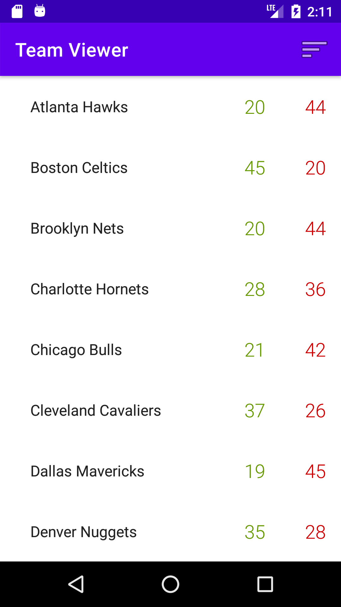
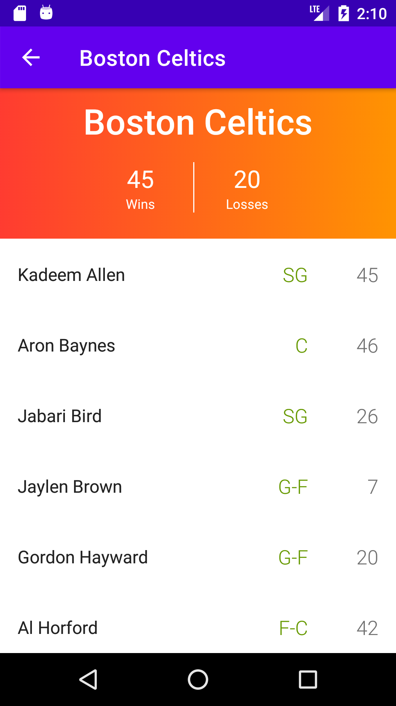
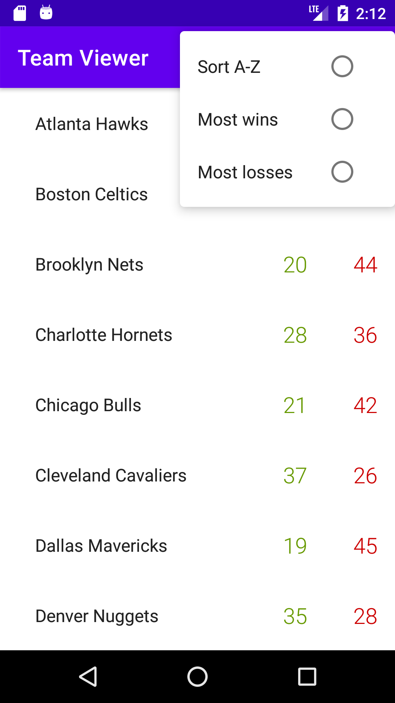
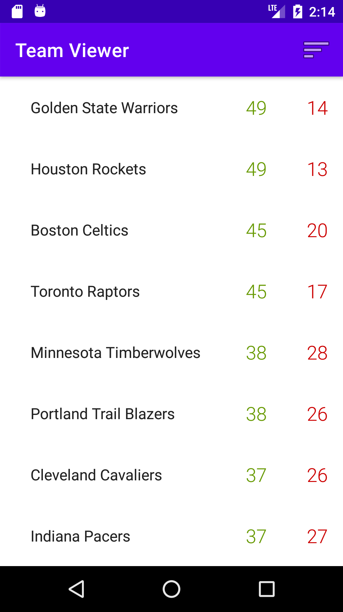
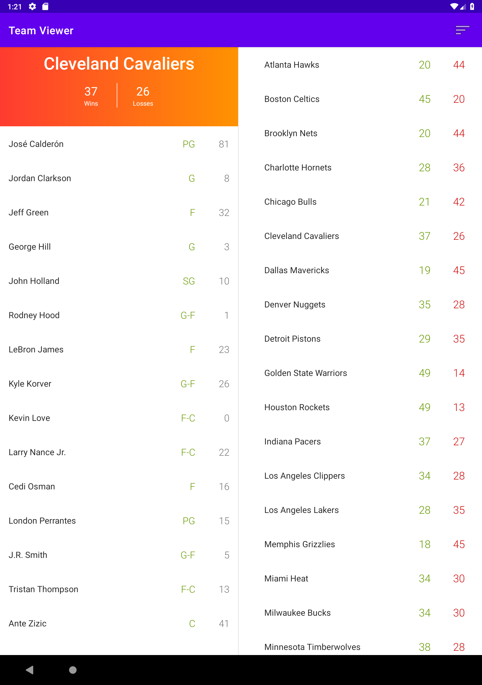

# "NBA Team Viewer" - The Score

## Table of contents
  *  [General info](#general-info)
  *  [Rubric](#rubric)
  *  [Screenshots](#screenshots)
  *  [Versioning and dependencies](#versioning-and-dependencies)

## General info
Android application with two screens; one screen with a Team list, and a second screen with a detail Team page.

## Rubric

#### Project Requirements

* Request Data
  * Request NBA teams data from [`input.json`](https://raw.githubusercontent.com/scoremedia/nba-team-viewer/master/input.json) endpoint using networking framework of your choice. 
  * Implement Network caching to cache the response. 
* The Team List screen
  * Displays all of the teams data in alphabetical order
  * Each team's `full_name`, `wins`, and `losses` must be displayed
  * When the user clicks a team it should launch their team page
  * Allow the user to sort the list by Alphabetical order.
  * **Bonus:** Allow the user to sort the list by `wins` or `losses` 
* The Team Page screen
  * Displays information about a specific Team selected from the Team List
  * The team's `full_name`, `wins`, and `losses` must be displayed
  * The team's roster must be displayed with each Player's `first_name`, `last_name`, `position`, `number`
* Unit Tests (You must write valid unit tests to test your code)
  * Write `Unit Tests` to test and verify how data retreived using API including success, failure etc..
  * Write `Unit Tests` to test and verify data sorting.
  * Write `Unit Tests` to test and verify how data are managed within the app. 
* **Bonus:** Robolectric Tests (No bonus if no Unit Tests written) 
  * Write `Robolectric Tests` to verify correct data are binding to UI.
  * Write `Robolectric Tests` to verify navigating from team list to team detail screen.
  * Write `Robolectric Tests` to verify performing the sorting action updates the screen with sorted data.

## Screenshots
| Main Activity - List of teams | Detail Activity - Team detail |
| :---: | :---: |
|  |  |

| Sort actions menu | Sorted by most wins |
| :---: | :---: |
|  |  |

| Tablet |
| :---: |
|  |

## Versioning and dependencies

**Target SDK Version:** 30

**Gradle Version:** 5.6.4

**Dependencies:**

**Android Studio Version:** 4.1.1. (Stable Release)

